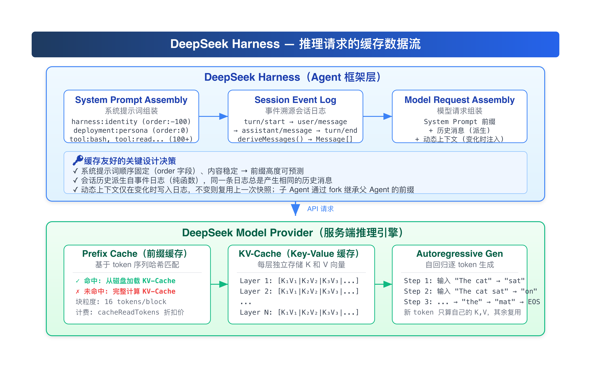
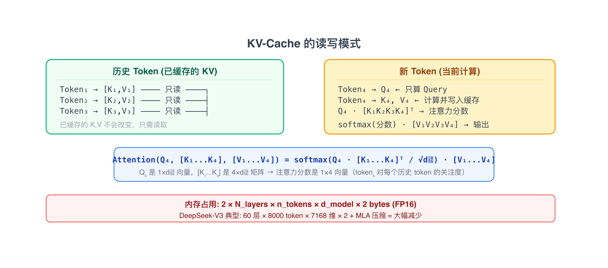
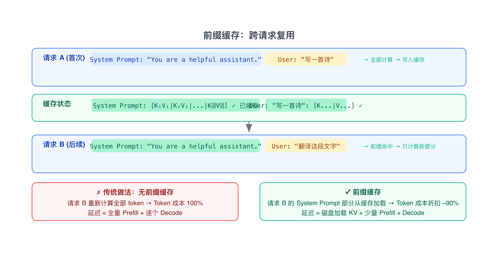
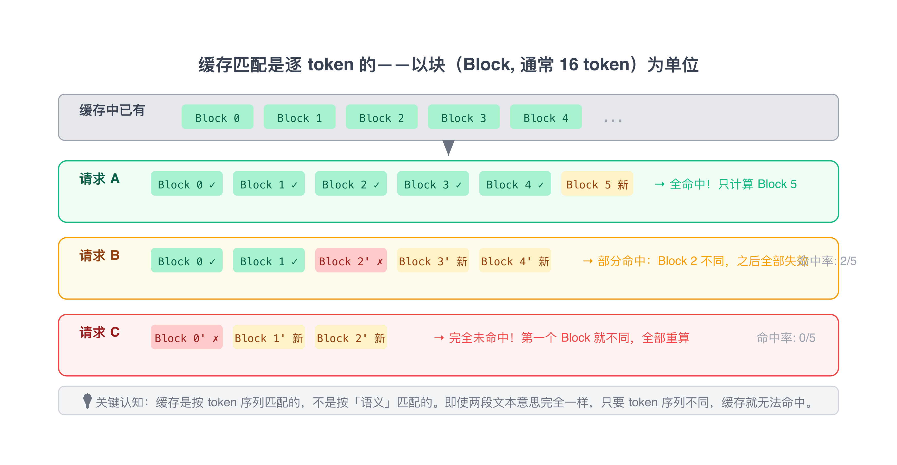
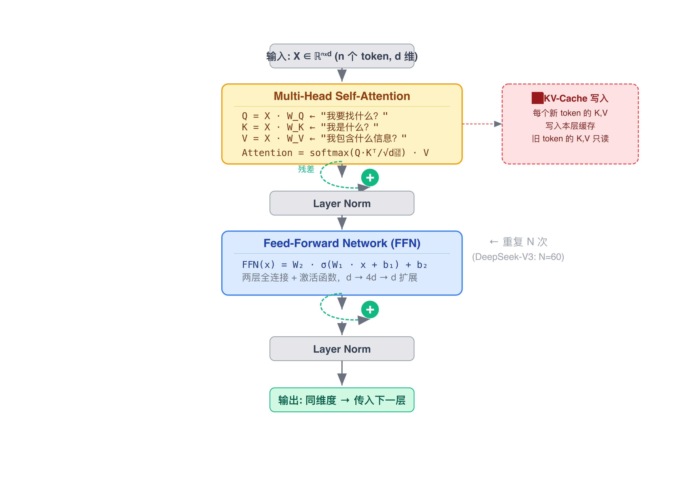
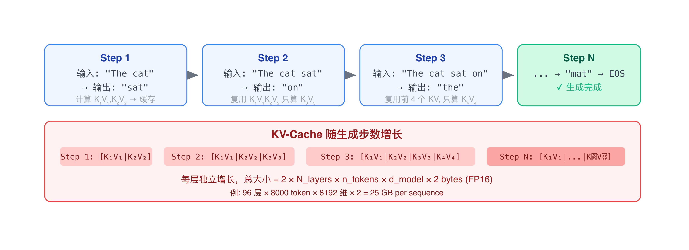

# LLM 缓存命中机制学习笔记（上篇）：原理

> 学习 Agent 缓存机制过程中整理的笔记。前 5 章是正文，第 6 章是顺带记录的 Transformer/QKV 数学推导，和缓存主线没有强依赖，跳过不影响理解。
> 
> 笔记拆成了三篇：上篇（本文）是缓存原理和优化思路；中篇是 DSH（DeepSeek Harness）的架构设计细节；下篇是评估验证时用的方法。

---

## 1. 为什么关心缓存

开发 Agent 的时候，同一个会话里前几轮模型回复几乎是「秒回」，但上下文变长或者重启会话之后，首 token 就要等好几秒。后来发现这背后就是**前缀缓存（Prefix Cache）**在起作用。

对 Agent 场景，缓存命中有三个收益：

**① 成本。** Agent 的输入天然很长——系统提示词、工具 schema、多轮历史、工具执行结果，单次请求几万 token 是常态。缓存命中的 token 按折扣计费（DeepSeek 约原价 10%），一个高频 Agent 任务动辄几十次模型调用，累积下来省了不少。

**② 延迟。** TTFT（Time To First Token）主要由 Prefill 阶段决定。缓存命中时，已缓存的 token 直接从内存读取（毫秒级），不用 GPU 重算 Prefill（秒级），差 1~2 个数量级。

**③ 吞吐。** 缓存的请求占算力更少，推理集群整体吞吐更高，高峰期排队延迟也降下来。

做缓存优化时，TTFT 的改善往往比 token 账单更影响用户体验，不能只盯着成本数字。

---

## 2. 一次推理请求的缓存路径



上图是数据从组装到发送的完整路径。下面逐层拆解。

---

## 3. 缓存的工作机制

### 3.1 KV-Cache：为什么只缓存 K 和 V

LLM 的自回归生成中，每一步只生成一个 token，追加到输入序列末尾，再生成下一个。如果每一步都重新计算整个序列的 Attention，第 1000 步就要算 1000 个 token 的 Key 和 Value。

KV-Cache 的思路：把已经算过的 Key 和 Value 向量缓存下来，后续步骤只需计算新 token 的 Q、K、V，然后用新 Q 去查所有历史 K，取对应的 V。

```
Attention(Q, K, V) = softmax(Q · Kᵀ / √dₖ) · V

对于自回归生成:
  Step 1: 输入 [x₁] → Q₁, K₁, V₁ → 用 Q₁ 去查 K₁, 取 V₁
  Step 2: 输入 [x₁, x₂] → Q₁, Q₂, K₁, K₂, V₁, V₂ → 用 Q₂ 去查 K₁,K₂, 取 V₁,V₂

观察:
  K₁, V₁ 在 Step 1 和 Step 2 中完全相同（K₁ = x₁ · W_K, V₁ = x₁ · W_V）
  但 Q₁ 在 Step 2 中不需要了——每个 step 只取最后一个位置的 Attention 输出来预测下一个 token

所以: 缓存所有历史 K 和 V，每步只需要新 token 的 Q
```



### 3.2 前缀缓存：跨请求复用

**前缀缓存（Prefix Cache）** 是 KV-Cache 的跨请求复用——两个请求共享相同的开头部分时，第二个请求可以直接复用第一个请求已经算好的 K 和 V。



### 3.3 缓存命中与未命中的边界条件

缓存命中要求从第一个 token 开始，连续的 token 序列完全匹配。一旦某个位置的 token 不同，该位置及之后的所有缓存都无法复用。



### 3.4 块级缓存

现代推理引擎（vLLM、DeepSeek 等）将 KV-Cache 分割为固定大小的 Block（通常 16 个 token），以 Block 为单位存储、匹配和复用。

```
为什么需要 Block？

问题: 按整个序列缓存，一个 token 变化就导致整个缓存失效
解决: 分成小块，每个块独立哈希匹配

Block 0       Block 1       Block 2       Block 3
┌──────────┐ ┌──────────┐ ┌──────────┐ ┌──────────┐
│ t₁...t₁₆ │ │ t₁₇...t₃₂│ │ t₃₃...t₄₈│ │ t₄₉...t₆₄│
│ K₁...K₁₆ │ │ K₁₇...K₃₂│ │ K₃₃...K₄₈│ │ K₄₉...K₆₄│
│ V₁...V₁₆ │ │ V₁₇...V₃₂│ │ V₃₃...V₄₈│ │ V₄₉...V₆₄│
└──────────┘ └──────────┘ └──────────┘ └──────────┘

每个 Block 独立哈希，匹配的 Block 可复用
Block 内 token 必须完全一致才能命中
```

### 3.5 「前缀一致 → KV 一致」的因果链

这是理解 Prefix Cache 最关键的一条链。为什么相同前缀可以直接复用 KV-Cache？因为 Transformer 的计算是**确定性的**：

```
相同前缀
  ↓  token 序列相同
  ↓  Embedding 相同
  ↓  第 1 层输入相同 → Q/K/V 相同 → Attention 相同 → 输出相同
  ↓  第 2 层输入相同 → Q/K/V 相同 → Attention 相同 → 输出相同
  ↓  ……
  ↓  所有层的 K/V 都相同
  ↓  可以复用 KV-Cache
```

> Prefix Cache 不是拍脑袋定的缓存规则，而是由 Transformer 的确定性计算结构 + Causal Attention 的因果依赖关系自然推导出来的。

为什么必须是「前缀」？自回归模型中，$t_i$ 只能看到 $t_1, \dots, t_i$，因此一个 token 的 K/V 是否稳定，取决于它前面的上下文。若把 `A B C D` 改成 `A X C D`，C、D 所看到的上下文都变了，它们的 K/V 也不能认为相同。所以最自然的可复用单位就是：**从序列开头开始完全一致的连续 token 前缀**。

### 3.6 注意力变体与缓存效率

不同注意力机制对 KV-Cache 内存占用的影响：

| 变体      | 全称                              | K,V 头数            | 缓存节省     | 代表模型               |
| ------- | ------------------------------- | ----------------- | -------- | ------------------ |
| MHA     | Multi-Head Attention            | h 个 K,V 头         | 基准       | GPT-3, Llama-1     |
| GQA     | Grouped-Query Attention         | g 个 K,V 头 (g < h) | ~h/g 倍   | Llama-2/3 (g=8)    |
| MQA     | Multi-Query Attention           | 1 个 K,V 头         | ~h 倍     | PaLM, Gemini 早期    |
| **MLA** | **Multi-head Latent Attention** | **低秩压缩 K,V**      | **极大减少** | **DeepSeek-V2/V3** |

MLA 是 DeepSeek-V2/V3 的核心创新：把 KV-Cache 压缩到一个低维潜在空间，推理时再从潜在向量重建 K 和 V。这使得在相同显存下可以服务更长的上下文。

### 3.7 上下文长度的硬约束

上下文窗口长度由训练时的位置编码和序列长度锁定，不是可以无限输入的。理解这个约束，才能理解为什么 Agent 长任务必然面临「截断 vs 缓存」的矛盾。

KV-Cache 的显存占用随序列长度**线性增长**：

```
KV-Cache 显存估算（FP16 精度）:

  显存 = 2 × n_layers × n_kv_heads × seq_len × d_head × 2 bytes

  举例（7B 级别模型，MHA，d_head=128，32 层，FP16）:
    seq_len = 4k    → KV-Cache ≈ 0.5 GB
    seq_len = 32k   → KV-Cache ≈ 4 GB
    seq_len = 128k  → KV-Cache ≈ 16 GB
```

GQA/MQA/MLA 能降低增长曲线的斜率，但斜率永远大于零。现代主流模型普遍采用 RoPE（旋转位置编码），训练时只见过位置 `0 ~ N-1` 范围内的旋转角度，超出后注意力分数变得不可靠。

对 Agent 开发的直接影响：系统提示词、工具 schema、多轮历史、工具结果都在消耗上下文预算。历史累积逼近上限时，框架必须截断或压缩，而截断又必然破坏前缀缓存——这就是矛盾的物理根源。

---

## 4. 缓存失效的边界条件

### 4.1 什么操作会破坏缓存

| 场景               | 是否失效  | 原因                      |
| ---------------- | ----- | ----------------------- |
| 追加新消息到对话         | 部分失效  | 新消息前的 token 仍可命中        |
| 截断/压缩历史（滑动窗口、摘要） | 大部分失效 | 历史前缀被改写，位置整体前移          |
| 修改 persona       | 完全失效  | 系统提示词第一个 token 就变了      |
| 新增/删除一个工具        | 部分失效  | 工具 schema 列表变化，从变化点开始失效 |
| 修改 `cwd` 等工作目录变量 | 部分失效  | 变量值变化导致 section 文本变化    |
| 更换模型             | 完全失效  | 不同模型的 KV 表示不兼容          |
| 修改 temperature   | 不影响   | 采样参数不影响 KV 计算           |
| 修改 max_tokens    | 不影响   | 只影响生成长度                 |

### 4.2 上下文截断与缓存的冲突

缓存要求历史「只追加、不修改」，上下文管理却要求「删旧、压缩」——两者天然对立。

问题从何而来：长任务中历史消息与工具结果不断累积，逼近窗口上限。缓存命中要求**从第一个 token 起逐块一致**，任何对历史的删除、改写、重排，都会让变化点之后的缓存全部失效。

一个反直觉的地方：直觉上「删掉最旧的消息」最安全，但对前缀缓存伤害最大：

```
═══════════════════════════════════════════════════════════════════
 阶段一：压缩前（第 4 轮，全部缓存可命中）
═══════════════════════════════════════════════════════════════════

 发送给模型的 token 序列（按 Block 切分，每块 16 token）:

 ┌──────┬──────┬──────┬──────┬──────┬──────┬──────┬──────┐
 │ B0   │ B1   │ B2   │ B3   │ B4   │ B5   │ B6   │ B7   │
 │ sys  │ sys  │ tool │ tool │ u₁   │ a₁   │ u₂   │ a₂   │ ...
 └──────┴──────┴──────┴──────┴──────┴──────┴──────┴──────┘
    ✓      ✓      ✓      ✓      ✓      ✓      ✓      ✓
  全部 Block 匹配 → 历史 100% 命中

═══════════════════════════════════════════════════════════════════
 阶段二：逼近窗口上限，执行滑动窗口截断（删掉 u₁,a₁）
═══════════════════════════════════════════════════════════════════

 直觉（错误）:
   "u₂,a₂ 之前缓存过，应该还能命中吧？"

 现实（缓存视角）:

 ┌──────┬──────┬──────┬──────┬──────┬──────┐
 │ B0   │ B1   │ B2   │ B3   │ B4   │ B5   │
 │ sys  │ sys  │ tool │ tool │ u₂   │ a₂   │ ...    ← 删掉 u₁,a₁ 后
 │      │      │ s    │ s    │  ←── u₂ 现在占据了原来 u₁ 的位置
 └──────┴──────┴──────┴──────┴──────┴──────┘
    ✓      ✓      ✓      ✓      ✗      ✗
   命中    命中    命中    命中   未命中  未命中
                          ↑
            B4 的内容从 [u₁] 变成了 [u₂]
            块哈希改变 → 不匹配 → 该块及之后全部失效

═══════════════════════════════════════════════════════════════════
 根本原因
═══════════════════════════════════════════════════════════════════

  前缀匹配从第 1 个 token 开始逐 Block 比较哈希:
    匹配:  [B0] → [B0,B1] → [B0,B1,B2] → ... 继续
    不匹配: 在 B4 处哈希不同 → 停止，B4 及之后全部 miss

  删掉任何一段前缀，后续 token 的块内分布整体移位/重排，
  Block 边界对齐发生变化，哈希全部不同。缓存视角下
  这根本不是「同一条序列去掉前面」，而是一条全新的序列。
```

| 缓解策略          | 做法                               | 缓存代价                        |
| ------------- | -------------------------------- | --------------------------- |
| 检查点式压缩        | 平时严格 append-only；只在逼近窗口上限时一次性压缩  | 每次压缩付一次全量失效，之后多轮重新享受高命中     |
| 摘要作为新前缀       | 压缩后的 [摘要 + 保留的近期消息] 成为新的稳定前缀     | 把失效成本批量化、低频化                |
| 子 Agent 隔离长任务 | 把会产生大量中间结果的子任务下放给子 Agent，主会话保持精简 | 主会话无需压缩；子 Agent 经 fork 继承缓存 |
| 控制上下文增速       | 限制单次工具输出长度、及时清理大体积中间产物           | 从源头推迟压缩时点                   |

每一次压缩都等于一次「缓存重置」，下一轮要全价重算 Prefill。理想的节奏是压缩**低频、批量化**——两次压缩之间间隔的轮次越多，缓存的摊销收益越大。逐轮滑动窗口是缓存视角下最差的设计，低频检查点式压缩则好得多。

---

## 5. 实践中总结的优化思路

这些不限于特定框架：

1. **保持系统提示词稳定。** 不要在运行时动态修改 persona 或工具集。系统提示词在最前面，它变了，后面全部缓存都失效。

2. **利用子任务隔离。** 把会产生大量中间结果的子任务下放给子 Agent，主会话保持精简。子 Agent 通过 fork 继承父 Agent 的上下文，免去重复计算。

3. **避免不必要的变量变化。** `cwd` 等环境变量尽量在会话生命周期内保持不变。如果必须在提示词中引用变量，确保它们在连续请求中值相同。

4. **固定工具列表顺序。** 工具 schema 在发送给模型前按固定规则排序，确保相同工具集产生相同的 token 序列。不要依赖默认字典序。

5. **尽量在同一会话中完成多轮对话。** 历史前缀越长，缓存收益越大。每次新开会话都相当于一次冷启动。

6. **将动态信息放在请求末尾而非开头。** 变化的部分越靠后，前面能命中的缓存越多。动态上下文（如当前时间、工作目录）放在系统提示词之后、用户消息附近，而不是最前面。

7. **规划上下文压缩节奏。** 压缩低频、批量化执行，避免逐轮滑动窗口截断。在两次压缩之间，让缓存充分摊销 Prefill 成本。

---

## 6. Transformer 与 KV-Cache 原理【可选】

> 前面用直觉解释了 KV-Cache。本章从 Transformer 的计算结构出发，解释为什么 KV-Cache 只需要缓存 K/V、为什么 Prefix Cache 可以跨请求复用，以及「前缀一致 → KV 一致」这条因果链从何而来。
> 
> 本章只保留理解缓存所必需的知识点。更完整的 Transformer 推理流水线（Encoder/Decoder 架构、Multi-Head Attention 细节、Sampling 策略等）见《Transformer 与 LLM 推理完整闭环》。

### 6.1 模型在做什么

LLM 首先通过 Tokenizer 把文本转换为 token ID 序列，再通过 Embedding 矩阵把每个 token ID 映射为高维向量。分词器是**确定性**的——同样的输入永远产生同样的 token 序列，这是缓存命中的前提。

```
文本 → Tokenizer → Token IDs → Embedding → 向量表示
```

拿到向量表示后，进入 Transformer。每个 Transformer 层包含两个核心子层：**Multi-Head Attention** 和 **FFN（Feed-Forward Network）**。



```
输入 Hidden States
        ↓
   Attention（token 间信息交互）
        ↓
   Residual / Norm
        ↓
      FFN（逐位置特征加工）
        ↓
   Residual / Norm
        ↓
下一层 Hidden States
```

这里有一个对理解缓存至关重要的认知：**Attention 不直接生成 token。** Attention 的输出不是「苹果」这个词，也不是概率，而是一个新的向量——结合了上下文之后的隐藏表示。它继续经过 FFN 和多层堆叠，最终得到 Final Hidden State。然后取**最后一个位置**的 Hidden State，通过 **LM Head**（线性投影）映射到词表空间，再经 Softmax 转换为概率分布：

```
H_last → LM Head → Logits → Softmax → 概率分布（如：苹果 42%, 香蕉 18%, …）
```

> Attention 是「信息交互机制」，不是「最终答案生成器」。LLM 并不是直接「知道答案」，而是通过神经网络计算出一个条件概率分布 $P(x_{t+1} \mid x_1, \dots, x_t)$。

### 6.2 Attention 的核心机制

既然 Attention 是信息交互的核心，它具体怎么工作？

给定输入矩阵 $X$，通过三个不同的线性变换得到 Q、K、V：

$$
Q = XW_Q,\quad K = XW_K,\quad V = XW_V
$$

| 向量       | 直觉                  | 通俗记忆     |
| -------- | ------------------- | -------- |
| Q（Query） | 我想从上下文中**寻找**什么信息   | 「我想找什么？」 |
| K（Key）   | 我这里**有什么**类型的信息可被匹配 | 「我有什么？」  |
| V（Value） | 我真正**提供**什么信息       | 「我提供什么？」 |

可以类比成数据库：Q = 查询条件，K = 索引，V = 真正的数据。三者来自同一个输入 $X$，但承担完全不同的角色。

Attention 公式：

$$
\boxed{
\mathrm{Attention}(Q,K,V)
=
\mathrm{softmax}
\left(
\frac{QK^T}{\sqrt{d_k}}
\right)V
}
$$

四步分解：

```
QKᵀ           → 计算相关性分数（我应该关注谁？）
÷ √dₖ         → 控制数值尺度（防止 Softmax 饱和）
Softmax       → 把分数变成注意力权重（分配多少信息）
× V           → 按权重聚合信息（加权求和）
```

这个公式就是理解 KV-Cache 的数学基础——注意 K 和 V 在公式中的角色：K 用来和 Q 做匹配计算权重，V 是按权重提取的实际内容。它们的计算只依赖当前 token 的输入 $x_i$，这正是后面「K/V 可以缓存」的根源。

### 6.3 自回归生成与 KV-Cache

LLM 的生成是**自回归**的：每次生成一个 token，追加回上下文，再生成下一个，循环直到输出终止符。



现在把 Attention 机制放进这个循环，就能理解缓存了。

**Q 为什么每轮重新计算？** 第一轮当前 token 是「吃」→ 计算 $Q_{吃}$，代表「吃这个位置，现在应该关注什么？」→ 预测「苹果」。下一轮当前 token 变成「苹果」→ 需要 $Q_{苹果}$，因为问题变成了「苹果现在应该关注什么？」。Q 是当前查询，每生成一个新 token 就变化，必须重算。

**历史 K/V 为什么可以缓存？** 第一次计算「我 喜欢 吃」时产生 $K_{我}, V_{我}, K_{喜欢}, V_{喜欢}, K_{吃}, V_{吃}$。生成「苹果」后，新序列变成「我 喜欢 吃 苹果」。「苹果」仍然需要关注历史 token，所以仍需要前面的 K/V。而这些历史 K/V 并没有变化——因为 $K_i = x_i \cdot W_K$，$x_i$ 是第 $i$ 个位置的输入，它不会因为后面新增了 token 而改变。Causal Attention 保证每个位置只能看到前面的 token，后面的 token 不会影响前面位置的 K/V 计算。

> 历史 K/V 已经计算过 → 直接保存 → 下一轮继续使用。新 token 只计算新的 $Q_{new}, K_{new}, V_{new}$。

```
                  KV Cache
               ┌─────────────┐
               │ K1 V1       │
               │ K2 V2       │
               │ K3 V3       │
               │ ...         │
               └──────┬──────┘
                      │ 历史信息
                      ↓
新 token → X → Q_new ─→ Attention
             │
             ├→ K_new → 加入 KV Cache
             └→ V_new → 加入 KV Cache
                      ↓
                Hidden State → LM Head → Next Token
```

这就是 KV-Cache 的完整计算模式。对应到推理引擎的实际执行，分为两个阶段：

- **Prefill：** 用户一次性提供 Prompt，模型并行处理整个输入序列，计算各位置的 K/V 并填充 KV Cache。计算密集，GPU 并行处理。
- **Decode：** 逐 token 生成，每一步用新 token 的 $Q_{new}$ 查询历史 K/V，预测下一个 token。历史 K/V 已在 Cache 中，不需要重算。

### 6.4 从 KV-Cache 到 Prefix Cache

理解了 KV-Cache，Prefix Cache 就只是往前再迈一步。

**KV Cache** 解决**同一请求内部**的重复计算——自回归生成时，Step 1 算过的 K/V 在 Step 2、Step 3 继续用，不需要每一步重算整个序列。

**Prefix Cache** 进一步解决**不同请求之间**的复用——如果 Request A 和 Request B 共享相同的前缀（如相同的 System Prompt + Tool Schema + 历史上下文），那么这部分 K/V 可以跨请求复用。

```
Request A: System Prompt + Tool Schema + 历史上下文 + 用户问题 A
Request B: System Prompt + Tool Schema + 历史上下文 + 用户问题 B
                                            ↑
                                    前面完全一样 → K/V 可复用
```

这条复用链路的因果逻辑是：

```
相同 Prefix → 相同 Token 序列 → 相同 Embedding / Position → 相同 Transformer 计算 → 相同历史 K/V → 可以跨请求复用
```

反过来，前缀一旦变化，变化位置之后的上下文表示全部变化，后续 K/V 不能继续认为相同，缓存从变化位置之后失效。

> Prefix Cache 不是孤立的「工程技巧」，而是由 **Transformer 的确定性计算 + Causal Attention 的因果结构 + 自回归生成方式**共同推导出来的计算结果复用机制。

### 6.5 本章小结

1. **Transformer 处理的是向量，不是文字。** $\mathrm{Text} \rightarrow \mathrm{Token} \rightarrow \mathrm{Embedding}$。分词器是确定性的，这是缓存命中的前提。
2. **Attention 负责上下文信息交互，不直接产生 token。** Attention Output 是中间表示，经过 FFN 和多层堆叠后，最终 Hidden State 经 LM Head + Softmax 才得到概率分布。
3. **Q/K/V 都来自输入 X。** $Q = XW_Q,\ K = XW_K,\ V = XW_V$。Q 是当前查询，每轮变化；K 是可匹配的索引，V 是实际内容，历史 K/V 不随新 token 改变。
4. **KV-Cache 缓存历史 K/V，每轮只算新 token 的 Q/K/V。** 这是 Causal Attention 的直接推论——后面的 token 不会改变前面位置的 K/V。
5. **Prefix Cache 是 KV-Cache 的跨请求推广。** 相同前缀 → 相同计算 → 相同 K/V → 可复用。它由 Transformer 的确定性计算 + Causal Attention 的因果结构共同保证。

---

## 附录：术语速查

| 术语          | 英文                          | 一句话解释                            |
| ----------- | --------------------------- | -------------------------------- |
| Token       | Token                       | 模型处理文本的最小单位                      |
| 分词          | Tokenization                | 将文本转换为 token 序列                  |
| 嵌入          | Embedding                   | 将 token 映射为高维向量                  |
| 自回归         | Autoregressive              | 每次生成一个 token，追加到输入再生成下一个         |
| 注意力         | Attention                   | 让每个 token 能关注序列中所有 token 的机制     |
| 因果注意力       | Causal Attention            | 每个 token 只能关注它前面的 token，不能「偷看」未来 |
| Softmax     | Softmax                     | 把任意实数向量映射为总和为 1 的概率分布            |
| Logits      | Logits                      | LM Head 输出的原始分数，未经 Softmax 转换    |
| LM Head     | LM Head                     | 语言模型头，将 Hidden State 线性投影到词表空间   |
| Query (Q)   | Query                       | 「我要找什么」                          |
| Key (K)     | Key                         | 「我是什么」                           |
| Value (V)   | Value                       | 「我包含什么信息」                        |
| KV-Cache    | KV-Cache                    | 缓存 Key 和 Value 向量，避免自回归时重复计算     |
| 前缀缓存        | Prefix Cache                | 跨请求复用相同前缀的 KV-Cache              |
| 缓存命中        | Cache Hit                   | 新请求的 token 序列在缓存中找到匹配            |
| 缓存未命中       | Cache Miss                  | 新请求的 token 序列未找到匹配               |
| 缓存淘汰        | Eviction                    | 因空间或时间限制从缓存中移除旧数据                |
| Transformer | Transformer                 | 基于 Self-Attention 的神经网络架构        |
| FFN         | Feed-Forward Network        | Transformer 中负责信息存储的两层全连接网络      |
| 残差连接        | Residual Connection         | 将子层输入直接加到输出上                     |
| Layer Norm  | Layer Normalization         | 对每个 token 向量在特征维度上做归一化           |
| Block       | Block                       | 缓存存储和匹配的基本单位（通常 16 token）        |
| Prefill     | Prefill                     | 推理第一阶段，并行处理输入 token              |
| Decode      | Decode                      | 推理第二阶段，逐个生成输出 token              |
| TTFT        | Time To First Token         | 从发出请求到收到第一个输出 token 的延迟          |
| 上下文窗口       | Context Window              | 模型一次请求能处理的最大 token 数             |
| 位置编码        | Positional Encoding         | 为 token 注入位置信息（如 RoPE）           |
| RoPE        | Rotary Position Embedding   | 旋转位置编码，现代主流 LLM 采用               |
| MHA         | Multi-Head Attention        | 标准多头注意力                          |
| GQA         | Grouped-Query Attention     | 分组查询注意力，减少 KV 头数                 |
| MQA         | Multi-Query Attention       | 多查询注意力，所有查询头共享一对 KV              |
| MLA         | Multi-head Latent Attention | DeepSeek 的低秩潜在注意力                |
| 上下文压缩       | Compaction                  | 把旧历史摘要为短文本以释放上下文空间               |
| 缓存命中率       | Cache Hit Rate              | cacheReadTokens 占总输入 token 的比例   |

---

## 参考链接

- [DeepSeek API 上下文硬盘缓存文档](https://api-docs.deepseek.com/zh-cn/guides/kv_cache/)
- [vLLM 自动前缀缓存设计](https://docs.vllm.ai/en/latest/design/automatic_prefix_caching.html)
- [KV Cache from Scratch (HuggingFace)](https://huggingface.co/blog/kv-cache)
- [DeepSeek-V2 论文：MLA 注意力机制](https://arxiv.org/abs/2405.04434)