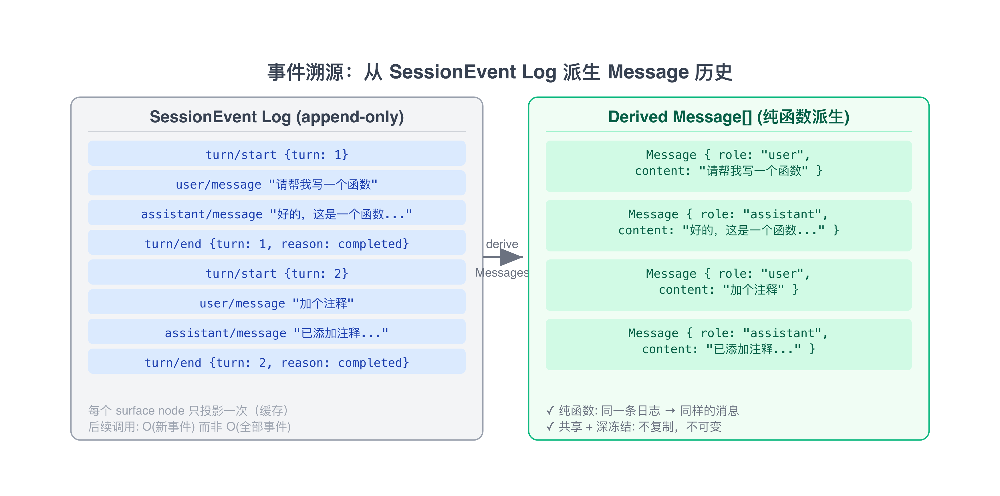
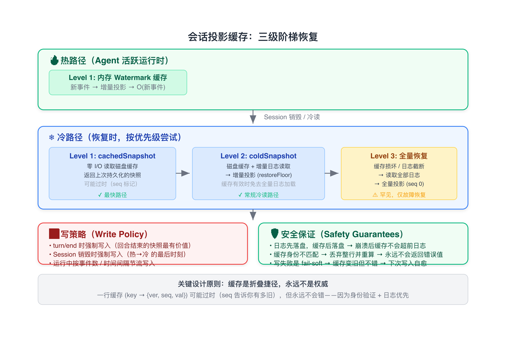
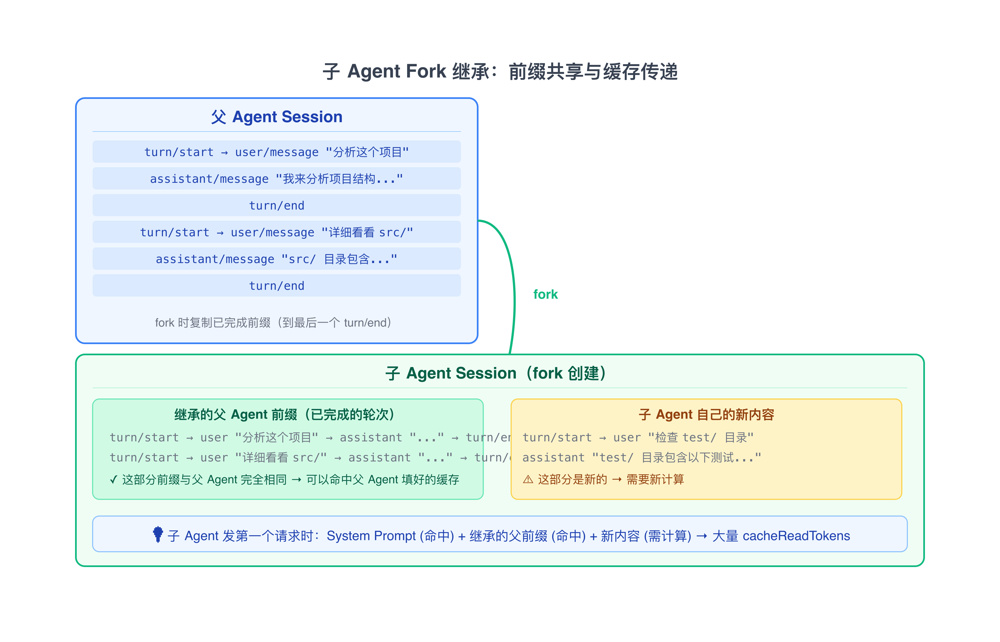
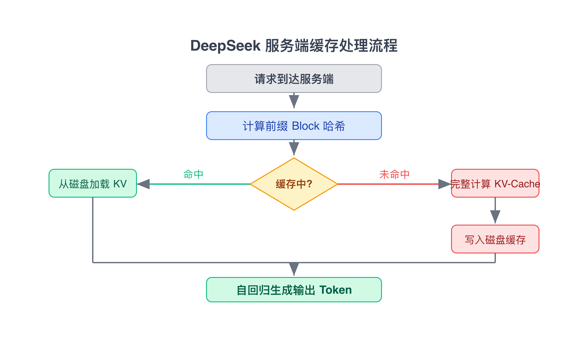

# LLM 缓存命中机制学习笔记（中篇）：DSH 架构设计

> 读 DSH（DeepSeek Harness）源码时整理的笔记，记录了框架在架构层面做了哪些设计来保证缓存命中率。如果也用 DSH 或者想参考一个成熟的 Agent 框架是怎么处理缓存问题的，这篇应该有用。
> 
> 代码引用均来自 DSH 源码（`packages/`），路径为仓库根目录下的相对路径。
> 
> 系列：上篇是缓存原理和优化思路；中篇（本文）是 DSH 的架构设计；下篇是评估验证时用的方法。

---

## 1. 问题：DSH 为什么需要从架构层面保证缓存命中率

DSH 是一个插件化 Agent 框架。提示词由多个插件各自贡献的 section 片段拼接而成，工具 schema 来自多个工具插件的注册，会话历史从事件日志中派生。一次模型请求的前缀可能来自 10+ 个不同的插件。

如果不从架构层面保证确定性，插件加载顺序、注册时机、变量值变化等任何微小差异，都会导致 token 序列不同，从而破坏缓存。

DSH 的做法：在框架层面提供一套保证，让开发者不需要手动操心缓存命中问题。这套保证贯穿提示词组装、上下文管理、会话日志、子 Agent 继承、工具排序、变量插值等各个环节。

---

## 2. 稳定的前缀组装

每次模型请求，DSH 都会组装一个系统提示词，由多个 `PromptSection` 按固定顺序拼接。组装过程必须每次产生完全相同的 token 序列。

### 2.1 PromptSection：按 order 固定排序

每个插件通过 `ctx.systemPrompt.section()` 注册提示词片段。`PromptSection` 接口：

```ts
// packages/core/system-prompt/src/index.ts

export interface PromptSection {
  readonly name: string        // 唯一名称，同层内重复注册会抛错
  readonly order: number       // 整数排序键，决定拼接顺序
  readonly text: string | ((context: AssembleContext) => string)
  readonly complete?: boolean  // 标记为「完整提示词」，覆盖其他 section
}
```

排序依靠显式的 `order` 字段，而非插件加载顺序。Convention 上，`-100` 是框架身份标识，`0` 是 persona，`100-199` 是工具使用指南。组装时按 `order` 升序排列：

```ts
// packages/core/system-prompt/src/index.ts（assemble() 方法内）

const sectionDefinitions = [...sectionByName.values()]
  .sort((a, b) => a.order - b.order)
```

不管插件加载顺序如何变化，只要每个 section 的 `order` 不变，拼接出的文本就是完全相同的 token 序列。

### 2.2 PromptContext：动态上下文与静态前缀分离

`PromptContext` 是另一种提示词贡献——它不进入系统提示词前缀，而是作为 user 角色消息注入到对话历史中。

```ts
// packages/core/system-prompt/src/index.ts

export interface PromptContext {
  readonly name: string
  readonly order: number
  readonly text: string | ((context: AssembleContext) => string)
}
```

`PromptContext` 与 `PromptSection` 分离处理：动态上下文仅在变化时写入会话日志，否则复用上一次的快照。

类比：`PromptSection` 像一本书的「序言」——每次打开书都在最前面；`PromptContext` 像书中的「便签」——只在内容更新时才贴一张新的，旧的留在原位。

因为 `PromptContext` 放在 user 消息中而非系统提示词里，它不影响前缀。系统提示词保持稳定，`PromptContext` 变化时，只有它所在的 user 消息及之后的 token 失效，前面的系统提示词缓存仍然可命中。

### 2.3 确定性工具 Schema 排序

工具 schema 在发送给模型前按固定规则排序。DSH 有两种模式：

**默认模式（字典序）：** 按工具名称的 code-unit 比较，locale-independent。

```ts
// packages/core/system-prompt/src/index.ts

function compareToolNames(a: ToolSchema, b: ToolSchema): number {
  return a.name < b.name ? -1 : a.name > b.name ? 1 : 0
}
```

**显式配置模式（toolOrder）：** 通过 `toolOrder` 配置项显式指定工具顺序：

```ts
// packages/core/system-prompt/src/index.ts

export interface Config {
  toolOrder?: string[]  // 包含 '<unlisted-tools>' 占位符
}
```

`<unlisted-tools>` 是保留标记，表示未列出的工具在此位置按字典序插入。`toolOrder` 在插件加载时验证（重复名、缺少 rest 标记都会报错），在组装时也验证（未知工具名报错）：

```ts
// packages/core/system-prompt/src/index.ts

function validateToolOrder(toolOrder: string[] | undefined): string[] | undefined {
  if (toolOrder === undefined) return undefined
  const seen = new Set<string>()
  for (const name of toolOrder) {
    if (seen.has(name)) throw new Error(`toolOrder lists "${name}" more than once`)
    seen.add(name)
  }
  if (!seen.has(TOOL_ORDER_REST)) {
    throw new Error(`toolOrder must contain the "${TOOL_ORDER_REST}" rest entry`)
  }
  return toolOrder
}
```

```
没有确定性排序:
  请求1: [bash, read, write, skill]  → 缓存
  请求2: [read, bash, skill, write]  → 缓存未命中（顺序不同，token 序列不同）

有确定性排序:
  请求1: [bash, read, skill, write]  → 缓存
  请求2: [bash, read, skill, write]  → 缓存命中 ✓
```

### 2.4 严格变量插值

DSH 的提示词模板支持 `{{variable}}` 语法。变量插值在 `renderPrompt` 阶段一次性完成，使用 `Object.hasOwn` 检查，未知引用直接报错：

```ts
// packages/core/system-prompt/src/index.ts（interpolate() 方法内）

if (!Object.hasOwn(variables, name)) {
  const known = Object.keys(variables)
  throw new Error(
    `unknown prompt variable "{{${name}}}" in ${kind} "${input.name}"; ` +
    `registered variables: ${known.length > 0 ? known.join(', ') : '(none)'}`
  )
}
const value = variables[name]
if (value === undefined) {
  throw new Error(
    `prompt variable "{{${name}}}" has no value for this assembly ` +
    `(${kind} "${input.name}")`
  )
}
```

未知变量直接报错而非静默跳过——防止出现「变量名打错了但框架没报错，提示词悄悄变短」的情况，这种隐性变化极难排查。

---

## 3. 会话历史的确定性派生

### 3.1 事件溯源日志

DSH 的会话历史不是直接存储消息列表，而是派生自一个只追加（append-only）的事件日志。同一条日志总是派生出完全相同的消息序列。



- 派生是纯函数，同一条日志 → 同样的消息 → 同样的 token 序列
- 多轮对话中，前面的轮次不变，只有最新轮次追加——前面轮次的 KV-Cache 可以复用
- 同一会话的每一次请求，前缀（系统提示词 + 历史消息的大部分）都是相同的

### 3.2 会话投影缓存（Session Projection Cache）

DSH 将派生结果持久化到磁盘，冷启动时无需重新从日志折叠。

```ts
// packages/session/session-projection-cache/src/index.ts

/**
 * Persisted projection cache: durable checkpoints of every registered
 * projection unit's state. The cache is a fold shortcut, never an authority:
 * a row is possibly stale (its `seq` says how stale) but never wrong.
 */
export class SessionProjectionCache extends Service {
  // ...
}
```

这个缓存的设计原则是「fail-soft」：写入失败只打 warning，下次写入或冷读时自动修复。缓存的 `seq` 字段记录了它截止到日志的哪个位置——如果日志比缓存新，就只折叠增量部分。



冷启动恢复会话时，DSH 不需要全量重建历史——从投影缓存中恢复之前的派生结果，然后只折叠新增的事件。恢复后的第一个请求，前缀和上次会话结束时完全一致，可以继续命中缓存。

---

## 4. 子 Agent 的 Fork 继承

当一个 Agent 需要创建子 Agent 来处理子任务时，DSH 使用 fork 机制：子 Agent 继承父 Agent 已完成的对话历史。

```ts
// packages/subagent/subagent-fork-in-process/src/index.ts

/**
 * The balanced completed-turn prefix of `parent`'s log: every event up to
 * and including the last `turn/end`.
 */
function completedTurnPrefix(parent: Agent): SessionEvent[] {
  const events = parent.session.events
  const lastEnd = events.findLast(e => e.type === 'turn/end')
  if (lastEnd === undefined) return []
  return events.slice(0, lastEnd.seq + 1)
}
```

在 `SessionStore` 中，fork 操作将父会话的已完成事件拷贝为子会话的种子日志：

```ts
// packages/core/session/src/index.ts

fork(source: SessionForkSource, boundary?: number, childSessionId?: SessionId): Session {
  const liveSource = this._resolveForkSource(source)
  const seed = this._forkSeed(liveSource, boundary)
  return this.create(childSessionId, {
    seed,
    meta: {
      ...liveSource.header.cwd !== undefined ? { cwd: liveSource.header.cwd } : {},
      parentSession: liveSource.id,
      seedLength: seed.length,
    },
  })
}
```



当子 Agent 发送第一个请求时，如果父 Agent 的请求已经填充了服务端缓存，子 Agent 的前缀中大量 token 可以直接命中缓存。

Fork 的种子是父会话的已完成轮次前缀，不包含当前正在进行的轮次（未完成的轮次事件不均衡，无法作为有效的子会话日志）。Fork 只在创建子 Agent 时捕获一次种子——后续即使父会话继续追加新轮次，子 Agent 的日志不会自动更新，它拥有自己独立的、可持久化的历史。

---

## 5. 服务端缓存层

DSH 对接 DeepSeek API，它在服务端实现了上下文缓存（Context Caching / Disk Cache），是独立于 DSH 框架的另一个缓存层。

### 5.1 工作原理



DeepSeek 的上下文缓存以固定大小的 token 块（Block，通常 16 个 token）为单位存储和匹配。每个 Block 的哈希由其包含的 token 序列计算，只有完全相同哈希的 Block 才能被复用。

### 5.2 计费模型与 TokenUsage

DSH 将每次模型调用返回的 token 用量拆分为四个互斥的桶：

```ts
// packages/llm/llm-deepseek/src/translate.ts

export function mapUsage(usage: WireUsage): TokenUsage {
  const cacheRead = usage.prompt_tokens_details?.cached_tokens
                 ?? usage.prompt_cache_hit_tokens
  return {
    inputTokens: usage.prompt_tokens - (cacheRead ?? 0),
    outputTokens: usage.completion_tokens,
    ...cacheRead !== undefined ? { cacheReadTokens: cacheRead } : {},
  }
}
```

DeepSeek API 返回的 `prompt_tokens` 是包含缓存命中的总数（`prompt_cache_hit_tokens + prompt_cache_miss_tokens`），DSH 的适配器在 `mapUsage()` 中把它减回去，恢复为独立的 `inputTokens`。

```
Token 用量分类（互斥，不重复计算）:

  inputTokens:      未缓存的新输入 token（全价）
  cacheReadTokens:  命中缓存的 token（折扣价，约 10%）
  cacheWriteTokens: 新写入缓存的 token
  outputTokens:     生成的输出 token（全价）

  总输入 = inputTokens + cacheReadTokens + cacheWriteTokens
```

### 5.3 缓存生命周期

- 缓存在一定时间无访问后自动淘汰（eviction），具体时间窗口由服务端策略决定
- 频繁访问的热缓存持续保留
- 服务端缓存是尽力而为的（best-effort），不保证一定命中
- 缓存跨不同模型不共享（不同模型的 KV 表示不兼容）

---

## 6. 设计决策一览

| 设计决策 | 解决的问题 | 效果 |
|----------|------------|------|
| 系统提示词按 order 排序 | 插件加载顺序影响前缀 | 前缀稳定 |
| PromptContext 分离处理 | 动态信息破坏前缀 | 历史前缀不受影响 |
| 事件溯源日志 | 历史派生不一致 | 相同日志 → 相同历史 |
| 子 Agent fork 继承 | 子 Agent 需重新计算全部上下文 | 共享父 Agent 缓存 |
| 会话投影缓存 | 冷启动需全量重算 | 快速恢复缓存状态 |
| 确定性工具排序 | 工具列表顺序漂移 | 前缀稳定 |
| 严格变量插值 | 变量值意外变化 | 未定义变量报错而不静默变化 |
| 服务端缓存适配 (mapUsage) | 缓存命中量被合并到 prompt_tokens | 独立报告 cacheReadTokens |

---

## 参考链接

- [DSH 架构文档](https://github.com/deepseek-ai/deepseek-harness/blob/master/docs/architecture.md)
- [DeepSeek API 上下文硬盘缓存文档](https://api-docs.deepseek.com/zh-cn/guides/kv_cache/)
- [DSH SystemPrompt 源码](https://github.com/deepseek-ai/deepseek-harness/blob/master/packages/core/system-prompt/src/index.ts)
- [DSH TokenMeter 源码](https://github.com/deepseek-ai/deepseek-harness/blob/master/packages/llm/token-meter/src/index.ts)
- [DSH SessionProjectionCache 源码](https://github.com/deepseek-ai/deepseek-harness/blob/master/packages/session/session-projection-cache/src/index.ts)